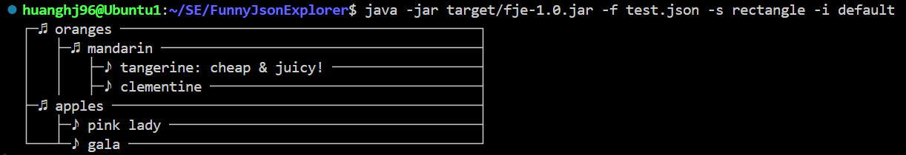

# FJE 设计文档

## 一、项目概述

本项目实现了 Funny JSON Explorer（**FJE**），一个 JSON 文件可视化的命令行界面小工具。项目使用了工厂方法、抽象工厂、建造者模式和组合模式这四种设计模式。该系统可以根据不同的风格创建树形结构的节点，并以不同的图标族展示这些节点。

## 二、UML类图

UML 类图展示了各个类之间的关系和设计模式的应用。通过 UML 类图，可以直观地看到工厂方法模式、抽象工厂模式、建造者模式和组合模式在项目中的实现。


## 三、设计模式使用说明

### 1. 工厂方法模式（Factory Method）

**作用**：定义一个创建对象的接口，但让子类决定要实例化的类是哪一个。工厂方法使一个类的实例化延迟到其子类。

**实现**：

- `NodeFactory` 是实现工厂方法模式的抽象类，定义了一个抽象的工厂方法 `createProduct`。
- `ConcreteNodeFactory` 实现了 `NodeFactory`，提供了具体的 `createProduct` 方法，用于创建 `Node` 对象。


### 2. 抽象工厂模式（Abstract Factory）

**作用**：提供一个创建一系列相关或依赖对象的接口，而无需指定它们具体的类。

**实现**：

- `AbstractJsonFactory` 是实现抽象工厂模式的接口，定义了创建相关对象的方法 `createContainer` 和 `createLeaf`。
- `RectangleStyleJsonFactory` 和 `TreeStyleJsonFactory` 实现了 `AbstractJsonFactory`，分别创建矩形风格和树形风格的容器和叶子对象。


### 3. 建造者模式（Builder）

**作用**：将一个复杂对象的构建与它的表示分离，使得同样的构建过程可以创建不同的表示。

**实现**：
- `Builder` 类通过 `buildContainer` 和 `buildLeaf` 方法分步构建 `Node` 对象，并通过 `getResult` 方法返回构建的最终产品。


### 4. 组合模式（Composite）

**作用**：将对象组合成树形结构以表示“部分-整体”的层次结构。组合模式使得用户对单个对象和组合对象的使用具有一致性。

**实现**：

- `Component` 接口定义了 `draw` 方法。
- `Container` 类表示一个容器节点，可以包含子组件。
- `Leaf` 类表示一个叶子节点。
- `RectangleStyleContainer` 和 `TreeStyleContainer` 类是 `Container` 的具体实现。
- `RectangleStyleLeaf` 和 `TreeStyleLeaf` 类是 `Leaf` 的具体实现。


## 四、可扩展性

### 1. 设置不同的风格

如果需要设置更多不同的风格，只需实现抽象工厂接口 `AbstractJsonFactory`，创建具体的风格工厂，然后提供对应风格的 `Container` 和 `Leaf` 的绘图逻辑即可。

### 2. 配置不同的图标族

如果需要配置不同的图标族，只需修改 `src/resource/config.yaml` 配置文件，为容器和叶子节点分别添加对应的图标即可。该配置文件如下所示：

```yaml
default:
  container_icon: "♫"
  leaf_icon: "♪"
poker-face:
  container_icon: "♢"
  leaf_icon: "♤"
star:
  container_icon: "✧"
  leaf_icon: "✯"
```

## 五、运行截图

本 Java 项目使用 `maven` 作为依赖管理工具，通过 `maven package` 对项目进行编译构建，因此只需输入如下命令即可运行项目，得到 JSON 文件的可视化效果：

```shell
java -jar target/fje-1.0.jar -f <json file> -s <style> -i <icon family>
```

树形风格 + 默认图标族：


矩形风格 + 默认图标族：



树形风格 + `poker-face` 图标族：


矩形风格 + `poker-face` 图标族：


